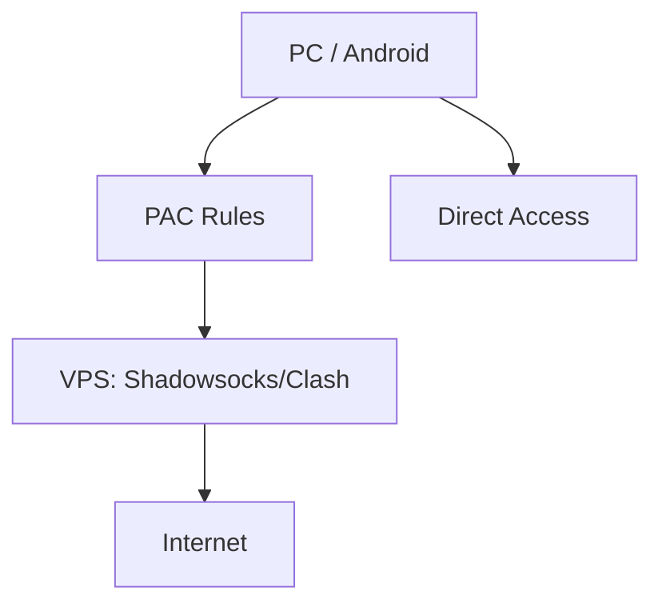

# Personal Proxy System on Debian 12

## Overview
This project demonstrates the setup of a **personal proxy system** using a VPS running **Debian 12**, **Shadowsocks**, and **Clash**. The system selectively routes applications through the VPS while other traffic remains direct.

---

## Technologies Used
- **Operating System:** Debian 12
- **Proxy Server:** Shadowsocks
- **Proxy Client / Routing:** Clash
- **Configuration Files:** JSON (Shadowsocks), PAC (Clash)
- **Networking Tools:** iptables / nftables for firewall rules

---

## Implementation Steps
1. **VPS Setup**  
   - Installed Debian 12 and performed basic security hardening (SSH, firewall).  

2. **Shadowsocks Deployment**  
   - Configured Shadowsocks server with secure password and encryption.  

3. **PAC Rules**  
   - Created custom PAC rules to route only selected applications (Google, WhatsApp).  

4. **Client Integration**  
   - Configured Clash on **Windows PC** and **Android** to use PAC file for selective routing.  

5. **Testing & Troubleshooting**  
   - Verified connectivity, resolved config errors, latency issues, and firewall rules.

---

## Results
- Selected traffic successfully routed through VPS.  
- Cross-device support achieved (PC & Android).  
- Documented setup process for replication and learning purposes.

---

## Learning Outcomes
- Linux server administration & SSH management  
- Network proxy setup with selective routing (PAC rules)  
- Cross-platform troubleshooting & optimization  
- Secure configuration of proxy servers

---

## Architecture Diagram



- **PC / Android**: Devices sending requests  
- **Clash / Shadowsocks Client**: Reads PAC rules to decide routing  
- **VPS**: Processes proxied requests and forwards them to the internet  
- **Direct / Proxy**: Traffic goes either directly or via VPS

---

## Example Config
```json
{
  "server":"123.45.67.89",
  "server_port":8388,
  "local_port":1080,
  "password":"REPLACE_WITH_YOUR_PASSWORD",
  "timeout":20,
  "method":"aes-256-gcm"
}
